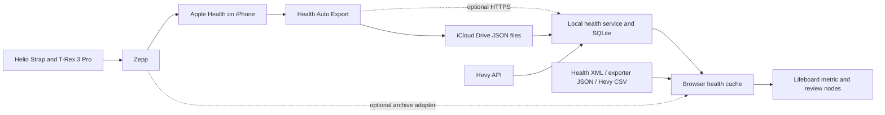

# Health integration: research and implementation handoff

Research date: 2026-09-07. Implementation update: 2026-09-08. A first local Apple Health version is implemented and tested with synthetic exports. No personal account or device export has been connected.

## Selected scope and current handoff (supersedes the broader proposal below)

The user selected **iPhone exporter → iCloud Drive → local Mac service → whiteboard**, with Apple Health only. Hevy is deferred because the user does not have Pro. Direct Zepp integration and its manual account-data export are deferred. Future self-hosting remains a later transport/deployment milestone.

Implemented packages: `health-core` (daily JSON validation, units, date windows, source selection), `health-service` (stable file scans, SQLite history, authenticated loopback read API), and `health` (twelve metric nodes, overview, chart options, dashboard command, connection/backup settings). The web host owns network/file/IndexedDB access. Readings stay outside board props and ordinary board backups; agent images containing health cards are blocked. See [setup instructions](apple-health-setup.md) and [verification and device audit](health-data-audit.md).

The initial importer deliberately accepts **daily Health Auto Export summaries only**. It does not implement raw-sample deduplication, XML import, workouts, frozen reports, tombstones, or remote ingestion. Source names are retained when present; an unnamed export is labelled `Export selection`. Repeated daily identities are upserted, competing sources are never added together, and file modification times order corrections. File omission/deletion does not remove stored rows. History is retained up to a stated record limit. Period comparisons require complete daily coverage.

Health backups are separate normalized JSON files in this version, with stable dataset identities; browser restore pauses refresh and service restore requires an empty database. This supersedes the proposed fresh-ID/remapping backup design below. “Pin these dates” fixes the query dates and continues receiving corrected values; immutable weekly report snapshots are deferred.

### Tasks for the next implementation agent

1. **Verify the real exporter contract.** Use the user's configured folder locally once available. Record app/device versions, names/units, date grouping, sources, and seven-day comparisons in `health-data-audit.md`. Keep original readings out of repository fixtures/logs. Add synthetic regression cases for any real contract differences. Do not claim unobserved Zepp fields are available.
2. **Validate unattended operation.** Observe overnight sleep arriving late, a Mac sleep/wake cycle, iCloud hydration, and a corrected previous day. Confirm which date ranges the exporter rewrites automatically. If older corrections are not refreshed, document a periodic manual overlap export or add a supported exporter schedule. A launch-at-login service can be added after the actual folder and Node installation are known; use absolute executable/workspace paths.
3. **Finish deletion reconciliation before broadening ingestion.** Define authoritative daily replacement scopes and source-policy changes with real export evidence. Never infer a deletion from an empty permission-limited export. Add reviewable dataset rebuild/retention controls and meaningful regression tests. Preserve the ability to restore current backups.
4. **Implement self-hosting when its target is chosen.** Add a Mac uploader or exporter HTTPS ingestion adapter, authenticated same-origin reads, persistent server storage, replay/idempotency handling, request limits, and tested backup restore. Preserve dataset identity across migration. The existing loopback service must not be exposed publicly without that work.
5. **Optional enhancements after coverage is known:** immutable weekly reports, personal baseline overlays, sleep timing/consistency from raw intervals, Apple Health workout cards, and additional standard HealthKit metrics. Each needs its own aggregation and validation semantics. Keep Hevy and proprietary Zepp scores deferred until explicitly brought back into scope.

Read the narrower setup guide before using the original phase list: the material below is retained as research and a longer-term design, not a claim that all its phases are implemented.

## Recommendation

Build a **Health & Training** Lifeboard extension with a shared health history, individual metric nodes, workout nodes, and a weekly overview. Sync opportunistically each day and derive weekly/monthly views from that history. A weekly overview is a presentation choice, not a reason to ingest only weekly totals.

Use **Apple Health through an existing iPhone exporter**, plus **Hevy's official API** for detailed lifting records. Start with the same export files imported manually to validate actual data availability. Keep Zepp-specific scores as a separate, optional source: an Apple Health integration cannot be assumed to expose everything visible in Zepp.

For a Mac running Lifeboard locally, the preferred automatic transport is **Health Auto Export → iCloud Drive → a small local import service → Lifeboard**. This avoids needing the iPhone to reach a sleeping Mac's HTTP endpoint. iCloud is an explicit transport choice, so exported files do pass through the user's iCloud account. For a hosted deployment or an always-on private server, use the exporter's authenticated HTTPS POST transport instead. A browser tab alone cannot provide a continuously available ingestion endpoint or read the iPhone's HealthKit store.

Assumptions pending user preference: one person, iPhone as the Health source, Mac/local usage suggested by the workspace, no existing health backend. Hevy Pro entitlement, willingness to use a paid exporter, actual app/firmware versions, and preferred transport are unconfirmed. These do not block the core extension or import-only milestone. No subscription purchase, account login, or deployment is part of this research task.

## 1. What the research establishes

### Apple Health

Apple documents HealthKit as a native framework with per-type authorization and an application capability. The practical implication for this React/Vite PWA is a native/export bridge; there is no documented browser OAuth/REST route to this person's Health database in the material reviewed. Moving the whiteboard into a Mac wrapper alone would not provide access to the iPhone's store. [Apple: configuring HealthKit](https://developer.apple.com/documentation/xcode/configuring-healthkit-access).

Read authorization has a deliberate ambiguity: a successful permission request does not prove that a metric is readable, and empty results cannot reliably distinguish denial from absent data. Newer documented access-window controls can also restrict history; check availability for the selected iOS target. Model “no readable samples” separately from a known unsupported type. [Apple: authorizing access](https://developer.apple.com/documentation/healthkit/authorizing-access-to-health-data).

Apple provides a manual XML export of health and fitness data. This is a useful no-subscription backfill and audit route, although large exports need streaming parsing. It exports what Health contains, not Zepp's private database. [Apple: export Health data](https://support.apple.com/guide/iphone/share-your-health-data-iph5ede58c3d/ios).

### Zepp / the Helio Strap and T-Rex 3 Pro

Amazfit confirms Apple Health as a supported integration, but the reviewed official material does **not** provide a complete, versioned export matrix for this exact device pair. Support for a metric in HealthKit does not establish that Zepp writes it. [Amazfit: supported apps](https://in.amazfit.com/pages/faq/what-apps-can-the-zepp-app-sync-with).

HybridCharge is a current product concept, not a misspelling of BioCharge. Zepp describes it as connecting BioCharge, training, recovery, and life context, including LifeLoad and perceived exertion. Its OS 6 page lists T-Rex 3 Pro compatibility, subject to feature/version/region differences. Store HybridCharge and BioCharge under distinct identifiers and preserve the actual labels seen on the user's version. [Zepp OS 6 overview](https://os.zepp.com/zepp-os-6-overview).

HRV export is evolving: Amazfit's Balance 3 release notes explicitly mention added Apple Health HRV synchronization. This proves that a blanket “Zepp never exports HRV” claim is unsafe; it does **not** prove that the user's strap/watch export the same fields. [Amazfit Balance 3 release notes](https://us.amazfit.com/collections/all-around/products/balance-3).

I did not find a documented, generally available, self-service **Zepp account-history API** suitable for treating as the default connector. Zepp OS developer APIs principally concern watch Mini Programs and watch faces; an OAuth UI component is not proof of a public Zepp cloud-data grant. A watch Mini Program could be a later experiment for supported on-device metrics, but would need separate device/history/transport validation and would not automatically expose the strap's consolidated history. [Zepp developer documentation](https://docs.zepp.com/docs/intro/), [Zepp OAuth component](https://docs.zepp.com/docs/v2/reference/app-settings-api/ui/auth/).

There are three other routes:

| Route | Evidence and limits | Decision |
|---|---|---|
| Official personal-data export | Zepp offers export under its privacy/user-rights controls. Exact archive schema, metric coverage, and delivery timing need a real archive. [Zepp privacy support](https://www.zepp.com/privacy-support) | Support known archive formats after inspection; useful for history and proprietary fields if present. Do not promise daily unattended export. |
| Terra's Zepp integration | Terra advertises Activity/Daily/Sleep, historical requests, and webhook delivery after polling Zepp, with managed credentials. It does not establish access to every proprietary score. [Terra Zepp integration](https://tryterra.co/integrations/zepp) | Technically viable commercial alternative; verify fields with sample payloads first. |
| Unofficial cloud clients | The author of `EvanCooke/zepp-export` reports Helio Strap support for heart rate, sleep, steps, stress, and training-load data, using reverse-engineered endpoints. This is an author claim, not a device test performed here. [Project source](https://github.com/EvanCooke/zepp-export) | Optional experimental adapter only. Token expiry, region routing, schema changes, maintenance, and actual metric coverage remain concerns. Never make core functionality depend on it. |

Terra currently lists Quick Start **from US$499/month**, which makes it a poor default for this personal board. Recheck before any commercial decision. [Terra pricing](https://tryterra.co/pricing).

### Health Auto Export as the iPhone bridge

The vendor documents JSON/CSV files, iCloud Drive automation, and REST POST delivery. Its published supported types include steps, energy, body mass, sleep, HRV, resting heart rate, temperature, and physical effort, provided records exist in Health. The exporter cannot manufacture missing Zepp fields. [Supported metrics](https://help.healthyapps.dev/en/health-auto-export/getting-started/supported-data/).

Automated exports require its Premium tier. The current FAQ lists US$0.99/month, $5.99/year, or $24.99 lifetime; storefront currency, regional availability, and pricing must be checked on the actual phone. The same FAQ says fixed-time or fixed-interval execution is not guaranteed. [Vendor FAQ](https://help.healthyapps.dev/en/health-auto-export/faq/).

The documented iCloud destination creates date-organized JSON/CSV files accessible to devices on the same account. The vendor identifies locked-phone access and iOS background scheduling as constraints. For the local Mac route, a service watches the selected export directory and rescans after wake; browser code does not directly watch iCloud. [iCloud automation](https://help.healthyapps.dev/en/health-auto-export/automations/icloud-drive/).

REST automation supports custom request headers, JSON export versions, time grouping, selectable date ranges, and batching. Version 2 is the recommended schema to validate first. “Previous 7 Days” plus a separate “Today” export can provide an overlapping correction window; a refresh button should still exist. Exact-time scheduling is a target, not a reliability promise. [REST automation](https://help.healthyapps.dev/en/health-auto-export/automations/rest-api/).

### Hevy

Hevy has an official public API restricted to **Hevy Pro**, with an API key obtained through its developer settings. Its published API remains explicitly subject to change. The current spec uses the `api-key` header; workouts paginate with a maximum page size of 10. The workout-events endpoint provides updated and deleted workouts since a timestamp. Workout records include exercise/set details, weights, reps, duration, distance, optional set RPE, and timestamps. Exercise templates can supply classification metadata. Poll away from exact hour boundaries as Hevy requests. [Hevy API and live specification](https://api.hevyapp.com/docs/).

Hevy also exports data through Profile → Settings → Export & Import Data → Export Data. Use this for the non-Pro/import-only path; inspect its actual CSV columns before defining the adapter. [Hevy export guide](https://help.hevyapp.com/hc/en-us/articles/38001424401943-How-to-Import-Strong-App-CSV-Files-and-Export-Your-Data-in-Hevy).

Hevy's Health integration writes strength workouts and an estimated calorie value. Its support guide also warns that fixing broken sync does not retroactively send previously missed workouts. Use the direct API/CSV for lifting history, and reconcile duplicated workouts/energy with wearable records. [Hevy calories](https://help.hevyapp.com/hc/en-us/articles/34462684813079-How-to-see-the-calories-burned-in-a-workout-Apple-iOS-Android), [Hevy sync troubleshooting](https://help.hevyapp.com/hc/en-us/articles/36957445562775-Hevy-Not-Syncing-to-Apple-Health-Step-by-Step-Troubleshooting-Guide).

## 2. Metric feasibility and node behavior

“Standard route” below means an available Health/export representation, **conditional on readable samples actually existing**. All proposed visualizations are product design choices, not vendor functionality claims.

| Requested metric | Proposed source / feasibility | Node views and semantic rules |
|---|---|---|
| Steps | Standard route; verify Zepp contributions against Health | Daily bars, goal progress, calendar heatmap; one chosen totals stream, not watch + strap + phone summed together. |
| Weight | Health body mass, Hevy measurements if available, CSV/manual | Latest dated measurement, scatter/line, weekly median; blanks remain gaps, no fabricated daily readings. |
| Calories burned | Health active energy and, separately, basal energy if populated | Active-energy bars; total expenditure only when both compatible components exist. Workout calories are a subset, never added again to daily active energy. |
| Sleep / sleep duration | Health sleep samples or exporter sleep summaries | Nightly duration, stage bars, bedtime/wake timeline. Stage charts require stage data. Keep naps and main sleep distinguishable. |
| Exertion | First identify the exact Zepp field; Health physical effort and Hevy set RPE have different meanings | Source-labelled trend. User-entered session RPE is a separate optional field. Do not rename METs, set RPE, and a Zepp daily score as interchangeable exertion. |
| HybridCharge / BioCharge | Zepp-specific; inspect official archive/experimental adapter | Dated reading, trend, intraday curve only when history exists. Separate metric keys; no fake reconstruction. |
| Exertion load / training load | Exact Zepp label and algorithm unresolved; optional Zepp import | Source-defined load trend; keep distinct from lifting tonnage and locally calculated session load. |
| Training status | Zepp-specific categorical output; optional import/manual | Status timeline with source timestamp; never derive vendor labels from incomplete generic data. |
| HRV | Health SDNN route exists; exact Zepp export and original method require audit | Nightly/daily trend and within-source baseline; retain method, sample window, and device. No SDNN/RMSSD conversion from summary values. |
| Resting heart rate | Standard Health field; verify that Zepp writes dedicated RHR samples | Daily trend and baseline; minimum recorded pulse is not silently treated as RHR. |
| Skin temperature | Zepp archive/optional adapter; Health route only if a compatible record is actually written | Absolute versus baseline-deviation charts with explicit measurement site; do not relabel wrist/skin temperature as core body temperature. |
| Sleep apnea risk | Zepp-specific assessment until proven otherwise | Imported vendor label/event with date. Apple breathing disturbances and sleep-apnea events are separate concepts; do not infer a risk score from SpO₂/sleep. |
| Heart health | A collection of available observations, not one universal score | RHR/HRV trends and imported high/low-HR or other events where available. Missing alerts never mean “normal” or “no risk.” |
| PAI | Zepp-specific; optional archive/manual/experimental source | Dated vendor score and trend; preserve rolling-score versus daily-earned semantics, do not sum rolling scores. |
| Gym workouts | Hevy API or CSV; Health fallback is a workout summary | Workout card, sets/reps table, exercise history, weekly working sets and recorded external-load volume. |

Semantic evidence: [Apple HRV uses SDNN](https://developer.apple.com/documentation/healthkit/hkquantitytypeidentifier/heartratevariabilitysdnn); [Apple sleep categories can overlap in-bed samples](https://developer.apple.com/documentation/healthkit/hkcategoryvaluesleepanalysis); [Apple sleep-apnea event type](https://developer.apple.com/documentation/healthkit/hkcategorytypeidentifier/sleepapneaevent); [Apple data-source prioritization](https://support.apple.com/en-lamr/108779). These APIs/categories do not establish Amazfit hardware support or Zepp export behavior.

## 3. Product design

### First useful board

A “Create health dashboard” command places a frame containing:

- **Last week** overview: activity, average sleep, recorded workout count, lifting work, available recovery trends, and a visible coverage count.
- Steps, active energy, sleep duration, weight, HRV, and RHR nodes. Unsupported/unobserved metrics offer setup information instead of a zero.
- A Hevy workout calendar/list and one exercise-progress node.
- An ordinary markdown note for the user's interpretation and next week's plan, linked to the overview using existing relations.

Each metric node has a metric selector, visualization selector, date window, aggregation, source policy, unit preference, and optional user goal. Default windows: yesterday for a daily number, previous completed Monday–Sunday week for the overview, and trailing 30 days for a trend. Offer 7/30/90 days and fixed dates. Make the week start and reporting timezone configurable; initialize the latter from the user environment (currently Asia/Tbilisi).

Expose separate **Steps**, **Sleep**, **Weight**, **HRV**, etc. entries in the node picker, while sharing definitions/renderers through a metric registry. This satisfies the request for different node types without duplicating chart logic. Additional types: workout, exercise progress, weekly overview, and comparison. Register all released schema types even when their source is unavailable; availability affects setup/creation guidance, not schema validity.

### Live views and pinned reviews

A live “last week” view follows the calendar and refreshes when imported data changes. A pinned review resolves an explicit week and stores an immutable report revision outside the shape, referenced by the shape. Show “as of” and coverage. Late data can create a revised report when requested; keep the original review and its linked notes intact. Automatically changing the date range must not create a new board node every day or week.

### Improvements worth including

- **Data-source/coverage panel**: last attempted sync, last successful import, newest sample per metric, readable days, provider, device when known, errors, and unsupported/unknown status. “Connected” is not proof of fresh data.
- **Recovery alongside training**: aligned sleep/HRV/RHR plots under Hevy session markers. A shared time axis is easier to interpret than a composite readiness score.
- **Life context**: use existing notes and properties for travel, illness, caffeine/alcohol timing, soreness, and subjective energy. No new third-party integration is required for manual annotations.
- **Strength progress**: per-exercise load/reps, working-set counts, frequency, and optional set-RPE views. Exclude warmups from working-set summaries by default and expose the choice.
- **Comparisons later**: paired observations with counts and optional lag, e.g. sleep before a workout versus recorded performance. Describe associations, not causes or prescriptions; suppress numerical correlations when coverage is too small.
- **Future adapters**: additional Health-fed scales or nutrition apps can reuse this pipeline for weight, body composition, protein, or hydration if those records are present. Do not build another login for data already available through Health. [Exporter supported data](https://help.healthyapps.dev/en/health-auto-export/getting-started/supported-data/).

## 4. Fit with this repository

Inspected the current checkout, rather than assuming a generic plugin architecture:

| Existing seam | Implementation implication |
|---|---|
| `apps/web/src/extensions.ts` | Composition root: add one package import and registration before registry consumers. |
| `packages/node-kit/src/extensions.ts` | Existing manifest supports nodes, settings, commands, imports, actions, overlays, operations, and synchronous board hooks. |
| `packages/node-kit/src/registry.tsx` | Props validators, migrations, shape utility, labels, and derived values; `dataProvider` is only a commented reservation, **not a working scheduler**. |
| `packages/book-reader/src/extension.ts` and `definition.tsx` | Examples for package boundaries, file import, node contributions, settings/actions; use the public node-kit barrel. |
| `apps/web/src/platform/PlatformAdapter.ts` | Storage/network boundary. Current KV/blob API is not a transactional time-series repository; network helpers do not support authenticated POST. |
| `apps/web/src/platform/WebPlatformAdapter.ts` | Browser IndexedDB implementation; canvas documents and app stores are separate. |
| `apps/web/src/persistence/backup.ts` and `assetRefs.ts` | Current backup walks boards/assets. A new health store is **not automatically included**. Restore-as-copy needs dataset/reference remapping. |
| `packages/node-kit/src/hooks.ts` | Hooks are synchronous and have no persistent background service lifecycle. Do not create a fetch timer per node or misuse board-open hooks for unattended sync. |
| `packages/node-kit/src/ops/shared.ts`, `ops/view.ts`, `apps/web/src/agent/boardContext.ts` | Generic agent reads and image exports can reveal visible health information. A new health-operation toggle alone would not cover these paths. |
| `packages/agent-host/` | Existing backend hosts agent sessions, not health ingestion. Prefer a separate optional local process so health sync does not depend on an AI session. |

New workspace packages proposed:

```text
packages/health-core/       Pure types, validation, adapters, aggregation, source policy
packages/health/            Lifeboard extension and node/chart UI
packages/health-service/    Optional local Node service: SQLite, file ingestion, Hevy polling
apps/web/src/health/        Host bindings, lifecycle, cached queries, integration setup
apps/web/src/persistence/   Browser health repository and backup integration
apps/web/src/platform/      Platform capability implementations
```

Keep `health-core` independent of React/tldraw so Node, browser workers, and a future native bridge share normalization. Follow the repository's rule that IndexedDB/file access stays in platform/persistence code. Add a narrowly typed host binding for repository/query access, analogous to existing bridges, rather than importing web-app internals into extension packages.

## 5. Storage and sync contract

### Two supported deployment modes



**Import-only:** the browser health repository is authoritative. Parsing occurs in a worker where expensive. It persists independently of board documents and can be used without the service or a paid exporter.

**Connected:** the service is authoritative for its dataset and the browser caches queryable history for offline display. Service revisions drive pull synchronization when Lifeboard opens, regains focus/network, or receives a refresh signal. Keep service and import-only datasets distinguishable. Imports into a connected dataset go through the service; offline imports can instead create a clearly named local dataset, with explicit later reconciliation. Do not invent bidirectional database replication for the first release.

SQLite belongs in the service; IndexedDB belongs in the browser. Prefer one authoritative service database plus a rebuildable cache over two writable copies. A provider account can be used by many nodes and boards without duplicating its records.

### Model to agree before adapter/UI work

Version all schemas and adapter/aggregation policies. Use discriminated records rather than treating every metric as an additive number:

```ts
type RecordKind = 'sample' | 'aggregate' | 'sleepSegment' | 'workout' | 'assessment'
type Availability = 'observed' | 'noReadableData' | 'unsupported' | 'error'

// Conceptual contract; choose the repository's validation style during implementation.
interface Provenance {
  provider: 'appleHealth' | 'hevy' | 'zepp' | 'manual'
  transport: 'healthXml' | 'autoExportJson' | 'hevyApi' | 'hevyCsv' | 'zeppArchive' | 'manual'
  connectionId: string
  sourceApp?: string
  device?: string
  method?: string
  originalUnit?: string
  adapterVersion: string
}
```

Persist these logical entities:

| Entity | Required responsibilities |
|---|---|
| Dataset / connection | Stable dataset identity, provenance, chosen metric scope, source preference, timezone, sync mode; credentials referenced externally. |
| Metric definition | Stable namespaced key, kind, canonical unit, aggregation options, compatible charts, method/site semantics. |
| Observation | Local ID, native ID if supplied, metric key, start/end instant or explicitly dated bucket, numeric/category value, provenance, original timestamps/offset, revision, received time. |
| Aggregate | Bucket boundaries/timezone, value/statistic, source-policy version, input coverage, resolution, provider revision; explicitly distinct from raw samples. |
| Workout / exercise / set | Provider IDs where available, times, exercise template, set index/type and optional measurements; relationships to duplicate representations. |
| Import batch | File hash or request ID, adapter/version/config, selected metric/date scope, validation counts, commit status, completeness assertion if actually known. |
| Sync state | Provider checkpoint, last attempt/success, processed revision, backfill progress, retry/error state; separate newest observation time. |
| Derived day / report revision | Query/policy versions, inputs/coverage, computed result, date window; recomputable unless explicitly pinned. |
| Tombstone / manual correction | Source-scoped deletion or explicit override, with provenance and precedence. |

Prefer kg, kcal, bpm, milliseconds for HRV, Celsius with measurement context, and seconds for duration internally. Convert for display; never round at ingestion. Preserve date-only data as date-only data. If an export has only an offset, do not claim it supplies an IANA timezone or a device identity.

Shape props contain small query/configuration fields: dataset reference, metric, chart, range mode, fixed dates, aggregation, source-policy reference, and optional report/workout ID. No API keys, imported payloads, long timeseries, or per-frame writes. Live values come from subscribed repository queries, with stable snapshots and memoization.

### Corrections, deduplication, and honest completeness

1. **Idempotency:** unique native IDs are scoped to provider/connection. For files without stable IDs, use a versioned deterministic identity from source, metric, temporal boundaries and record position/semantics; hash the batch to prevent exact repeat imports. Aggregate identity excludes the current numeric value so a corrected total replaces it. Ambiguous raw-record corrections require replacing a verified scope or retaining an unresolved conflict, not silently merging by value.
2. **Partial payloads:** importing one metric or one chunk must not clear other metrics/days. Stage and validate before committing. Never infer deletions from a missing field or an empty Health query.
3. **Exporter limitations:** JSON records may lack source/native IDs, and grouped exports are aggregates rather than recoverable raw samples. The documented schema has special HR and sleep shapes; do not force everything through `qty`. Preserve unknown provenance and resolution. [Exporter metric schema](https://help.healthyapps.dev/en/health-auto-export/export-format/health-metrics/).
4. **Replacement versus patch:** a full selected-day/metric export can replace that exact scope only when its completeness is established. A direct third-party POST lacking batch count, full-scope metadata, or a trustworthy export revision is an upsert, not an authoritative deletion message. Do not invent metadata the exporter does not send. Reconciliation imports provide explicit scope confirmation; keep deletion limitations visible.
5. **Out-of-order deliveries:** prefer source update/export revisions where available. File modification time alone is not proof of freshness. Serialize local automation jobs, reject stale known revisions, and make ambiguous conflicts visible; a delayed old upload must not silently overwrite newer confirmed history.
6. **Two wearable sources:** use a per-metric preferred stream. If Zepp has already consolidated both devices, consume its consolidated stream once. Preserve alternatives for inspection. Do not promise exact Apple Health totals merely by adding XML samples: Health prioritizes sources, and export files may not encode the UI's full policy. Validate selected-day totals against Health. With only daily totals, choose one daily stream rather than adding different source totals or using `max` as a deduplication algorithm.
7. **Hevy/wearable workouts:** use explicit links when available. Otherwise suggest a duplicate match using compatible activity, temporal overlap, and duration (initial heuristic: starts within 10 minutes and intersection/union duration at least 0.8). Do not auto-collapse ambiguous matches. A confirmed group counts as one session; retain Hevy for sets and the selected wearable for HR/energy. Link/unlink is reversible.
8. **Calories:** selected daily active energy is the total; workout energy is its drill-down. Do not add Hevy calorie estimates or a second device's calories to it. Basal + active yields a total only over compatible, sufficiently covered periods.
9. **Sleep:** choose one compatible source, union overlapping asleep intervals, and avoid counting in-bed/awake time as asleep. Prefer specific stages over overlapping unspecified-asleep samples. Attribute the main night to its wake date; expose naps separately. Split other interval metrics at calendar boundaries only when their measurement semantics allow it. Test travel, DST and midnight crossover.
10. **Availability:** absent is null/unknown, not zero; a day with no workouts can be zero only after the workout source has been successfully reconciled for that period. Report observed days/expected days, and label partial today. Compute means from valid observations with denominators shown; do not claim full-day coverage just because one sample exists.
11. **HRV and temperature:** keep method/site/window differences in separate series. Do not pool SDNN, RMSSD, or unknown Zepp HRV into one baseline. A single nightly statistic is not a beat-to-beat series. Likewise, absolute wrist temperature and deviation from a personal baseline are different metrics.
12. **Load:** locally defined session load may be `session RPE × duration in minutes`, explicitly labelled and only when the user supplies session RPE. Hevy's set RPE is not session RPE. Lifting volume can be `recorded external kg × reps` for compatible weighted sets, with bodyweight/assistance and other exercise types handled separately. Do not claim equivalence to Zepp exertion, PAI, training status, or injury risk.

### Cadence and retention defaults

- Initial import: offer **90 days** of available history; 30 days as a smaller option. Hevy backfill can be longer because workout records are sparse. Never assume enabling sync causes Zepp/Hevy to backfill Health.
- Normal operation: target a daily morning update after device sync and phone unlock; opportunistic updates later in the day. Local service processes available files promptly. Show stale values with timestamps instead of blocking charts.
- Corrections: reprocess changed daily files, rescan the last 7 days on service start/wake, and offer a previous-30-days reconciliation. For REST, configure overlap as described above. A lookback cannot guarantee changes older than that window; provide explicit historical refresh/import.
- Hevy: backfill workout pages, then poll events with a small overlapping `since` window. Record the run-start high-water mark, process every page idempotently, and advance only after a successful durable run. Account for pagination shifting during concurrent edits; replay overlap and periodically reconcile the full list. Apply delete events and recompute affected reports. Use modest request rates, jitter, bounded exponential backoff, `Retry-After` when supplied, and pause on authentication failure.
- Retention: proposed default **90 days of detailed time series, 24 months of daily summaries, workout/set history retained until user deletion**. Make the policy configurable and visible before pruning. Keep compact method/coverage metadata with retained summaries so long trends remain interpretable. Raw input archives are optional and time-limited; deletion applies to both parsed records and retained files under the service's control.
- Pinned reports retain their documented as-of revision until deleted. Removing a connection stops future sync; deleting its dataset removes local observations/caches/reports as selected and leaves explanatory placeholders on boards. It does not delete upstream Health/Zepp/Hevy records or external iCloud files automatically.

### Local service and transport

Implement a standalone process with a clear start/stop command, local data directory, SQLite migrations, and logs containing counts/status rather than values/tokens. Offer an optional documented launch-at-login setup after a working foreground service exists. Startup scans and periodic reconciliation supplement filesystem notifications, because cloud hydration and sleep can miss events.

For iCloud: user selects the known export folder; ignore temporary/partial files, wait for stable content, parse before commit, rescan after wake, and preserve failed files for retry. Test replacement-in-place and files initially present only as cloud placeholders. Confirm that historical corrected files are regenerated by the actual exporter configuration; otherwise document explicit range re-export.

For local web usage, a dev proxy and a production same-origin service route are preferable to coupling the UI to an arbitrary localhost port. A hosted HTTPS site must not assume unrestricted access to a loopback HTTP service: choose a deployed HTTPS endpoint or a tested private-network setup. On iPhone, `localhost` means the phone, not the Mac.

Proposed service API (names may change once contracts are reviewed):

```text
GET  /health/v1/status
POST /health/v1/imports/auto-export       # native exporter payload, scoped ingest token
POST /health/v1/imports/files            # explicit import with validated adapter/scope
GET  /health/v1/changes?after=<revision>  # committed changes and tombstones for browser cache
POST /health/v1/sync/hevy                # trigger a queued read-only upstream sync
GET  /health/v1/series?...               # bounded query
GET  /health/v1/workouts?...             # bounded query
```

The third-party exporter cannot be assumed to support a custom HMAC/chunk protocol. Accept its documented payload and authentication headers, then wrap it internally in a versioned import batch. Separate ingest and UI credentials; require authentication even on loopback, bind locally by default, validate Origin/Host for browser requests, bound body/decompressed size, and use TLS for non-loopback transport. Keep Hevy keys in the service's credential facility (OS keychain or restricted configuration), never node props, client bundles, URLs, or backups. The connector performs upstream reads only.

### Backups and agent access

Define two explicit export choices: a board/layout export without health data, and a health-inclusive backup containing selected datasets plus report revisions. Integrate the latter into the backup manifest with a format migration and warnings older readers understand. Exclude credentials in both. Restore datasets under fresh identities, rewrite shape/report references, and leave connections disconnected until configured. Account for health storage in the app's Storage screen and cleanup flows; its existing asset garbage collector must not accidentally remove pinned report material.

Keep automatic health ingestion and statistical summaries local. Before advertising “health data is excluded from AI,” cover the existing generic board-read, property/query, label, and image-export paths as well as any new health operations. A minimal first version can redact dedicated health shapes from agent serialization and omit them from programmatic board image exports while health sharing is off; consent is a settings choice for sharing selected summaries. Test both paths. User-authored notes/tables copied from health values and manually attached screenshots need clear scope treatment; do not claim a guarantee those paths do not enforce. Avoid populating universal health-value properties by default until that exposure policy is implemented.

## 6. Execution phases and acceptance criteria

These tasks can be assigned to another implementation agent sequentially. If multiple agents are used later, agree on `health-core` and repository interfaces first; work on disjoint package paths, with one integrator owning host changes.

### Phase 0 — Validate actual data and freeze the adapter contract

Deliver `docs/health-data-audit.md` with a matrix of requested metrics: observed source, record format, unit/method, earliest/latest time, and whether export succeeds. Mark untested entries explicitly.

User-assisted steps, only where needed during implementation:

1. Record iOS, Zepp, exporter, watch and strap versions; confirm exact “exertion,” “exertion load,” and “heart health” labels.
2. After Zepp device sync, inspect Apple Health's per-type data-source list and recent samples. Compare yesterday's steps/energy, a full sleep night, and a Hevy workout recorded with a wearable.
3. Use a 7-day exporter JSON or local Apple Health XML export for development, including an overnight sleep and one overlapping gym session. Use a 90-day export for backfill/performance validation when available.
4. Confirm Hevy Pro for API access; otherwise inspect a CSV export. A key is entered locally, not committed or pasted into documentation.
5. Request a Zepp official archive locally if proprietary-score coverage matters. Catalog its contents before implementing a parser; do not fabricate an archive schema from screenshots or another product's exports.

Acceptance: each proposed automatic metric has a real sample or is labelled “not yet verified”; original values remain local; repository fixtures are synthetic equivalents. Missing private samples do not block creating the model, synthetic fixtures, UI, or import pipeline, but do block claiming live connector validation. Choose iCloud for confirmed Mac-local preference, REST for a reachable service, or keep import-only if the user prefers no paid bridge.

### Phase 1 — Core model and import-only vertical slice

Own `packages/health-core`, `packages/health`, and browser repository bindings.

- Create versioned metric definitions, normalized record validation, a transactional repository contract, and synthetic 90-day data with intentional gaps/duplicates/corrections.
- Implement exporter JSON v2 import and Hevy CSV once their formats are established. Add Apple Health XML/ZIP backfill using incremental parsing and bounded decompression; explicitly handle the export's normal DOCTYPE without resolving external entities.
- Validate content before import. Use a dedicated picker/command for generic `.json`, `.csv`, and `.zip`, since the current extension file-import contract claims by suffix and must not capture all unrelated files.
- Create Steps and Sleep nodes plus a previous-week overview as an end-to-end slice, with loading/empty/error/offline states, meaningful labels, and migrations from v1.
- Register the extension and expose its setup panel. Import reports show accepted/skipped/conflicting records and date coverage.

Acceptance: importing twice changes no totals; reload preserves data; two nodes query one dataset; missing dates stay missing; sleeping across midnight reports the expected wake date; drag/zoom generates no health ingestion or tldraw writes. Imported data remains available if the extension is toggled off and back on.

### Phase 2 — Remaining core nodes and report behavior

Own extension UI; coordinate host backup/privacy changes with the integrator.

- Add weight, active/basal energy, HRV, RHR, generic source-labelled assessments, workout cards, and exercise progress.
- Add shared accessible SVG charts: number/sparkline, line, bars, heatmap, sleep stages; keyboard/focusable details, readable axes/units, and a text/table alternative. Downsample dense display series without changing stored facts.
- Build the dashboard command, fixed/relative ranges, pinned report revisions, comparison periods, and coverage indicators.
- Add manual dated values for unavailable proprietary metrics with provider/manual labels; no recurring prompt is needed if the user does not want to track them manually.
- Integrate dataset-aware backup/restore, storage usage/deletion, and the defined agent exposure policy before labelling the feature ready for personal data.

Acceptance: a previous-week dashboard can be reproduced from its selected dataset/policy; updating current data refreshes live views but not pinned report revisions; restoring a health-inclusive backup in a clean browser renders offline with remapped references; layout-only restore shows a reconnect/import placeholder; no credential appears in either export.

### Phase 3 — Automatic import and Hevy sync

Own `packages/health-service`, host lifecycle/transport bindings, and setup documentation.

- Implement SQLite authority, transactional import batches, commit revisions, cache deltas/tombstones, and startup recovery.
- Implement the selected iCloud watcher or HTTPS receiver; the other transport can follow after the preferred path works. Include an exact exporter setup recipe verified against the actual app version and a synthetic sample file/request.
- Implement official Hevy backfill/events synchronization, credential handling, retry/status, and reversible workout duplicate linking.
- Add foreground/launch-at-login service instructions and a production connection path. Browser background timers are never the source of scheduled ingestion.
- Show successful import versus upstream newest sample separately, plus “sync now,” retry, pause/disconnect, and historical reconciliation.

Acceptance: a real selected metric and a real Hevy workout reach Lifeboard through the chosen transport; a repeated request is harmless; restart midway through import recovers safely; a missed-day outage catches up; editing/deleting a Hevy workout updates derived results; expired credentials stop retries appropriately without losing cached history. Test a sleeping Mac and locked phone without claiming fixed-time delivery. If Hevy Pro is absent, validate CSV behavior and mark API live testing pending.

### Phase 4 — Zepp-specific metrics, after evidence exists

- First implement a parser for the observed official archive fields, with manual values as fallback.
- If automatic proprietary scores are still desired, evaluate a source-pinned unofficial client in isolation. Inspect its actual implementation, tests, license, supported fields and authentication before reuse; the README is not enough. Use recorded synthetic contract fixtures and explicit unsupported states for undocumented fields.
- Keep experimental failures isolated from Apple Health/Hevy ingestion. Preserve region and method metadata and give credentials the same treatment as other service secrets.
- Terra is an alternative only if its cost and confirmed field coverage make sense; a native watch Mini Program is a separate research spike, not a dependency of this extension.

Acceptance: each enabled score has a verified field mapping and sample history. HybridCharge, PAI, training status, apnea risk, and “heart health” are never invented from generic inputs. Every unverified metric remains visibly unavailable or manual.

### Phase 5 — Optional native iPhone companion and further analysis

Only build a Swift/HealthKit companion if the exporter demonstrably fails requirements such as provenance, deletion fidelity, or export control. Reuse the ingestion model, rather than changing the node UI.

Use per-type read permissions, a foreground backfill, observer notifications plus anchored queries for inserts/deletes, persistent per-type/query-version anchors, and a durable upload outbox. Advance the local query anchor only with the committed outbox; remove outbox batches after acknowledged server ingestion. Handle revocation, limited history, locked-device access failures, OS availability checks, and anchor invalidation with a controlled reconciliation. Background wakeups remain system-scheduled. Real-device testing and a chosen signing/distribution method are required. [Apple anchored queries](https://developer.apple.com/documentation/healthkit/hkanchoredobjectquery), [Apple deleted objects](https://developer.apple.com/documentation/healthkit/hkdeletedobject), [HealthKit background capability](https://developer.apple.com/documentation/xcode/configuring-healthkit-access).

Later product work: personal baselines with minimum coverage, workout/sleep comparisons, additional Health-fed nutrition/body measurements, and weekly review templates. Keep derived estimates distinctly labelled and avoid medical diagnoses or automated training prescriptions.

## 7. Verification required of the implementation agent

Use meaningful synthetic fixtures, with a separate local smoke test against the user's data. Minimum automated cases:

| Area | Required cases |
|---|---|
| Parsing | JSON general/HR/sleep variants, CSV quoting/units/nulls, XML time offsets and legacy sleep categories, unknown metric, malformed file, bounded ZIP/XML resource use. |
| Idempotency/corrections | Same batch twice, same bucket with corrected value, partial metric update, stale delivery, mixed import sources, incomplete batch/crash, explicit deletion and empty-data ambiguity. |
| Time | UTC offsets, Asia/Tbilisi reporting days, DST zones, travel, date-only entries, sleep crossing midnight, naps, completed calendar week versus trailing seven days. |
| Aggregation | Wearable duplicates, Health source policy, overlapping asleep/in-bed intervals, no energy double count, missing days, weight gaps, rolling-score handling, HRV method isolation. |
| Hevy | Full pagination, concurrent edits with overlapping events, deleted workout, null RPE, warmup/bodyweight/assistance handling, duplicate workout link/unlink, auth failure, rate limiting and retry. |
| Persistence | Schema migration, offline reload, service restart, cache revisions/tombstones, retention, shared dataset across boards, delete/reconnect, health-inclusive backup restore with fresh IDs. |
| UI/agent | Node creation/configuration, keyboard/chart alternative, fixed/live/pinned windows, stale/partial state, disable/re-enable, generic agent reads and image export under the chosen exposure policy. |
| Performance | 90-day dense synthetic dataset imported without blocking the canvas; bounded chart points; multiple nodes share queries; no writes/facts recomputes triggered by drag or zoom. |

Run the relevant package unit tests during each phase, then the repository's existing `pnpm typecheck`, `pnpm test`, `pnpm build`, and appropriate Playwright production-build coverage (`pnpm test:e2e`). Include extension types in schema/snapshot fixtures and review whether operation-manifest fixtures change. Record actual commands/results; do not report a live sync or native-device check that only used mocks.

Estimated implementation effort, as planning judgment rather than a commitment: Phase 0 one short audit plus any export wait; import-only core/dashboard roughly 4–7 developer days; broader nodes/backup/policy roughly 3–6 days; local service and Hevy roughly 3–6 days. Proprietary Zepp access has uncertain scope. A production-quality native companion is a separate multiweek project. These estimates assume one developer/agent, no deployment/account delays, and should be revised after the first real export.

## 8. Copyable handoff prompt

> Implement the Health & Training extension described in `docs/health-integration-plan.md`. Read the repository's instructions and existing extension/platform/backup/agent seams first. Begin with Phases 0–1 and deliver a working import-only vertical slice; continue through the selected core-node and automatic-sync phases as configuration and evidence permit. Use `packages/health-core` for shared validation/normalization, `packages/health` for nodes, and a separate optional `packages/health-service` for SQLite/file ingestion/Hevy. Keep datasets outside tldraw props and render through subscribed queries. Preserve provenance, missingness, corrections, and method differences. Prefer exporter → iCloud → local service for confirmed Mac-local use, or authenticated HTTPS for an appropriate reachable service. Support manual import without subscriptions; use Hevy API only with Pro and locally configured credentials. Do not promise Zepp-specific metrics until real fields are verified, and do not make an unofficial API a core dependency. Include the stated backup, source deduplication, offline, and agent-exposure behavior. Use synthetic repository fixtures and keep personal exports/credentials local. Maintain `docs/health-data-audit.md` and update phase status with actual validation results. If live credentials/data are unavailable, finish all independently testable authorized work and state precisely which live checks remain, without claiming those connectors are verified.

## Research limits

This research inspected public first-party documentation, the public Hevy specification, one clearly identified third-party project's source documentation, and the current Lifeboard repository. It did not access the user's health records, inspect a private export, test the devices, purchase an exporter, or exercise authenticated APIs. Product/version availability and vendor prices are snapshots of the research date. The main unresolved issue is **actual Zepp field coverage**, not whether Lifeboard can support the extension.
